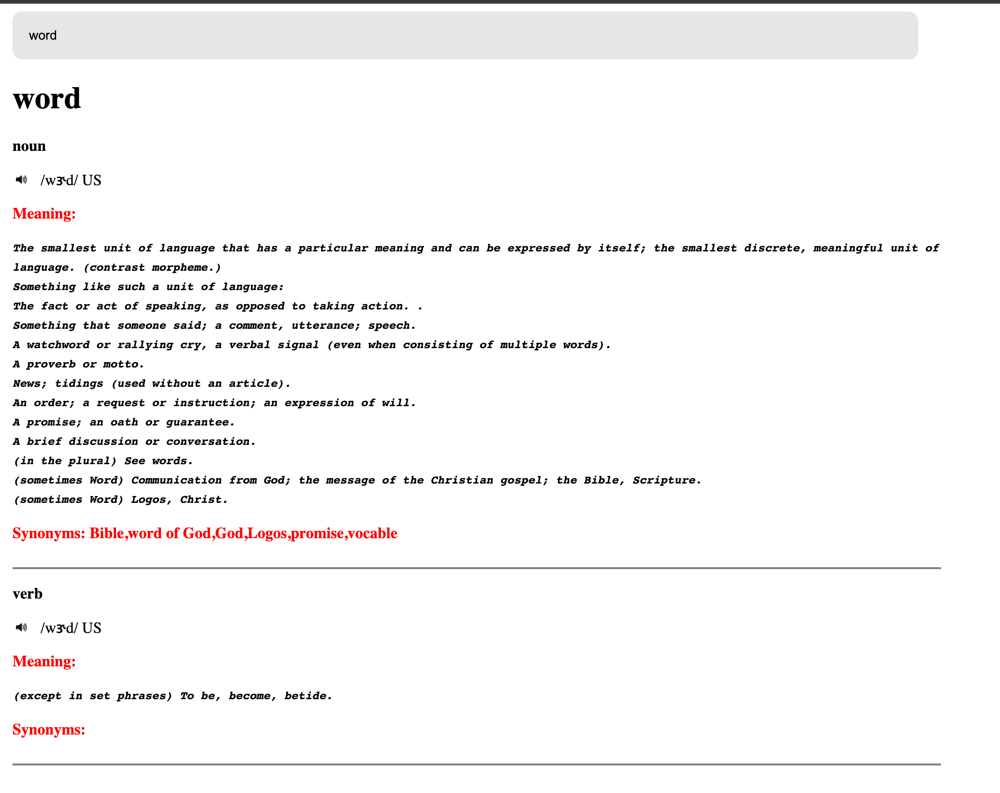

# Dictionary web application in vanilla js

This repository aims at developing dictionary web app where user can search for a word and 
see its meanings as well as its pronunciation. This application is written using Vanilla js, HTML and CSS.

# Approach 

- This application was developed with modular approach which helps us break down the scripts into smaller scripts
- This leads us to find a way to communicate between different scripts in a way that they are loosely coupled to each other.
- If you want to learn more about the approach you can check out this blog article.
  https://medium.com/@yasemincidem/dictionary-web-application-f77a1ef84793

Demo


## Commands

```bash
npm install      # installs corresponding packages
npm start      # run web server
```
---
